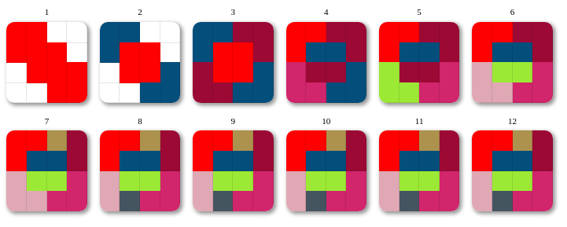

# theme-swatch

Install

```shell
npm i @react-theming/theme-swatch
```

Usage

```js
import { createSwatch } from '@react-theming/theme-swatch';
/* you need to provide a `styled` functions from Styled Components, Emotion or '@storybook/theming'  */
import styled from '@emotion/styled';

const ThemeSwatch = createSwatch(styled);

colors = ['red', 'green', '#13f0b7', 'rgb(100,180,250)'];

const YourComponent = () => {
  return <ThemeSwatch theme={colors} size={64} />;
};
```



## Credits

<div align="left" style="height: 16px;">Created with ❤︎ to <b>React</b> and <b>CSS-in-JS</b> by <a
    href="https://twitter.com/UsulPro">@usulpro</a> [<a href="https://github.com/react-theming">React Theming</a>]
</div>
